<p align="center">
  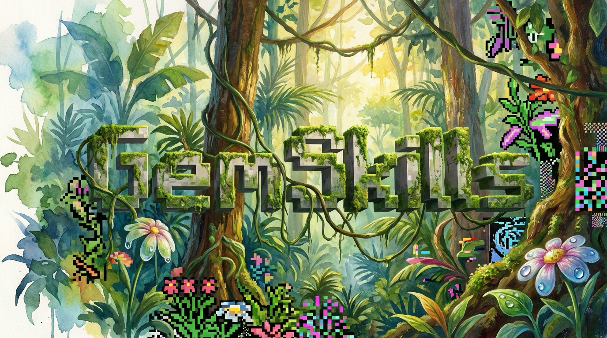
</p>

# Gemini Skills for Agents

Claude Code and Codex plugin for Gemini-powered image generation, video generation, editing, and visual analysis. Powered by **Gemini 3.1 Pro** (`gemini-3.1-pro-preview`), **Nano Banana Pro** (`gemini-3-pro-image`), **Veo 3.1** (`veo-3.1-generate-preview`), and **Gemini 3 Flash**. 169 art styles, text-to-video, image-to-video, pixel avatars, presentation decks, and more.

Every image and video on this page was generated using gemskills.

## Installation

### Claude Code

```bash
/plugin marketplace add b-open-io/claude-plugins
/plugin install gemskills@b-open-io
```

The Claude plugin includes Lisa, the `content` agent, natively.

### Codex

Install Gemskills from the b-open-io Codex marketplace:

```bash
codex plugin marketplace add b-open-io/gemskills --ref master
codex plugin add gemskills@b-open-io
```

The plugin exposes its skills and the explicit
`$gemskills:codex-agent-setup` installer skill. Codex plugin installation alone
does **not** install custom agents.

When you explicitly want Lisa available to Codex, invoke the setup skill or run:

```bash
bash skills/codex-agent-setup/scripts/setup.sh          # current project
bash skills/codex-agent-setup/scripts/setup.sh --user   # user scope, explicit only
```

The installer copies `gemskills-content.toml` as a regular file and never edits
global Codex configuration. Start a new Codex session after installation, then
invoke Lisa with the runtime agent name `gemskills_content`.

<details>
<summary>Individual skills (for other agentic frameworks)</summary>

```bash
bunx skills add b-open-io/gemskills --skill generate-image
bunx skills add b-open-io/gemskills --skill generate-video
bunx skills add b-open-io/gemskills --skill browsing-styles
bunx skills add b-open-io/gemskills --skill avatar-portrait
bunx skills add b-open-io/gemskills --skill team-group-photo
bunx skills add b-open-io/gemskills --skill generate-icon
bunx skills add b-open-io/gemskills --skill edit-image
bunx skills add b-open-io/gemskills --skill upscale-image
bunx skills add b-open-io/gemskills --skill segment-image
bunx skills add b-open-io/gemskills --skill optimize-images
bunx skills add b-open-io/gemskills --skill generate-svg
bunx skills add b-open-io/gemskills --skill section-dividers
bunx skills add b-open-io/gemskills --skill deck-creator
bunx skills add b-open-io/gemskills --skill ask-gemini
bunx skills add b-open-io/gemskills --skill setup
```
</details>

**Requirements**: `GEMINI_API_KEY` ([get one](https://aistudio.google.com/apikey)) is the baseline and powers every skill.

Optional keys unlock additional providers for image/video/edit:

| Key | Unlocks | Get one |
|-----|---------|---------|
| `GEMINI_API_KEY` | Gemini Nano Banana Pro images, Veo 3.1 video, all 169 styles (default) | [aistudio.google.com](https://aistudio.google.com/apikey) |
| `OPENAI_API_KEY` | OpenAI **`gpt-image-2`** image generation + masked editing | [platform.openai.com](https://platform.openai.com/api-keys) |
| `XAI_API_KEY` | xAI **Grok Imagine** image + **`grok-imagine-video-1.5`** video | [console.x.ai](https://console.x.ai) |
| `REPLICATE_API_TOKEN` | Icon background removal; Veo reference-image / last-frame video | [replicate.com](https://replicate.com/account/api-tokens) |

### Providers & auto-pick

`generate-image`, `generate-video`, and `edit-image` accept `--provider gemini|openai|xai`.
Omit it and gemskills **auto-picks the best provider whose key is present and that
supports the request** — e.g. plain image → `gpt-image-2`, video → `grok-imagine-video-1.5`,
but anything needing **style tiles, reference images, transparency, or negative
prompts routes to Gemini** (the only provider that supports them).

Set your own defaults interactively with **`/gemskills:setup`** (or the `setup`
skill), or pin them via env (`GEMSKILLS_IMAGE_PROVIDER`, `GEMSKILLS_VIDEO_PROVIDER`,
`GEMSKILLS_EDIT_PROVIDER`) or a `.gemskills.json` (project) / `~/.config/gemskills/config.json`
(global) file. Per-provider prompt templates live in `providers/prompts/` and are
tuned independently. Keys are read from one canonical env var each — gemskills
never falls back to alternate names; a missing key fails loudly.

---

## Video Generation

Generate videos from text or animate existing images with Veo 3.1. Native audio, 720p/1080p/4K, 4-8 second clips, and all 169 art styles.

### Style + Prompt &rarr; Image + Prompt &rarr; Video

<table>
<tr>
<td align="center"><strong>Style</strong></td>
<td align="center">&rarr;</td>
<td align="center"><strong>Generated Image</strong></td>
<td align="center">&rarr;</td>
<td align="center"><strong>Generated Video</strong></td>
</tr>
<tr>
<td align="center">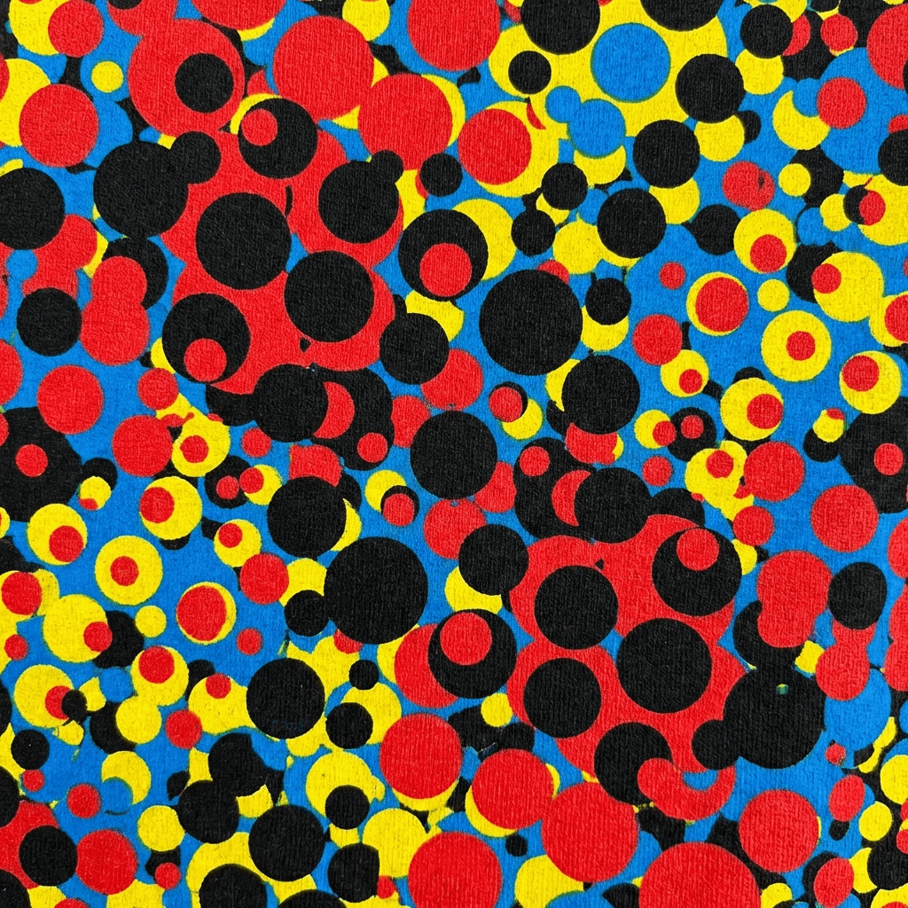<br/><sub><code>--style kusm</code></sub></td>
<td align="center"><sub>+prompt</sub></td>
<td align="center"><br/><sub>Nano Banana Pro</sub></td>
<td align="center"><sub>+prompt</sub></td>
<td align="center"><br/><sub>Veo 3.1 &middot; 8s</sub></td>
</tr>
<tr>
<td align="center">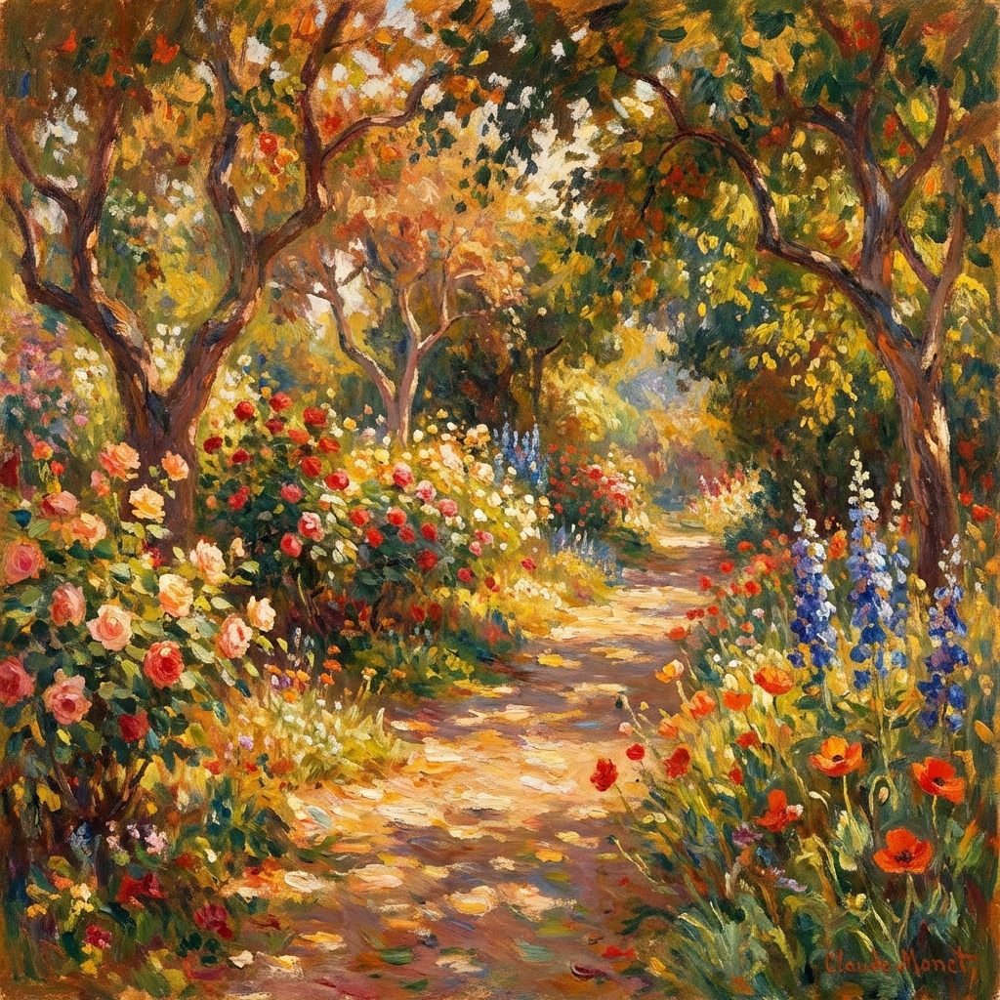<br/><sub><code>--style impr</code></sub></td>
<td align="center"><sub>+prompt</sub></td>
<td align="center"><br/><sub>auto-generated</sub></td>
<td align="center"><sub>+prompt</sub></td>
<td align="center"><br/><sub>Veo 3.1 &middot; 8s</sub></td>
</tr>
</table>

The two-step pipeline gives full creative control: generate a styled image first, then animate it. Or use `--auto-image` to do both in one command.

### Text-to-Video

Prompt alone &rarr; complete scene with audio. No input image needed.

<p align="center">
<br/>
<sub><em>"Ocean waves crashing on dark volcanic rocks at golden hour..."</em> &middot; 8s &middot; ~67s gen</sub>
</p>

> [Text-to-video demo](skills/generate-video/examples/text-to-video/prompt.md) | [Image-to-video demo](skills/generate-video/examples/image-to-video/prompt.md) | [Auto-image pipeline demo](skills/generate-video/examples/auto-image-pipeline/prompt.md)

---

## Image Generation

### 169 Art Styles

Every image and video generation supports `--style` to apply any of 169 curated art styles. Each style includes an AI-generated tile reference image sent to Gemini alongside the prompt for dramatically better style adherence.

<table>
<tr>
<td align="center"><br/><sub><b>Kusama</b> <code>kusm</code></sub></td>
<td align="center">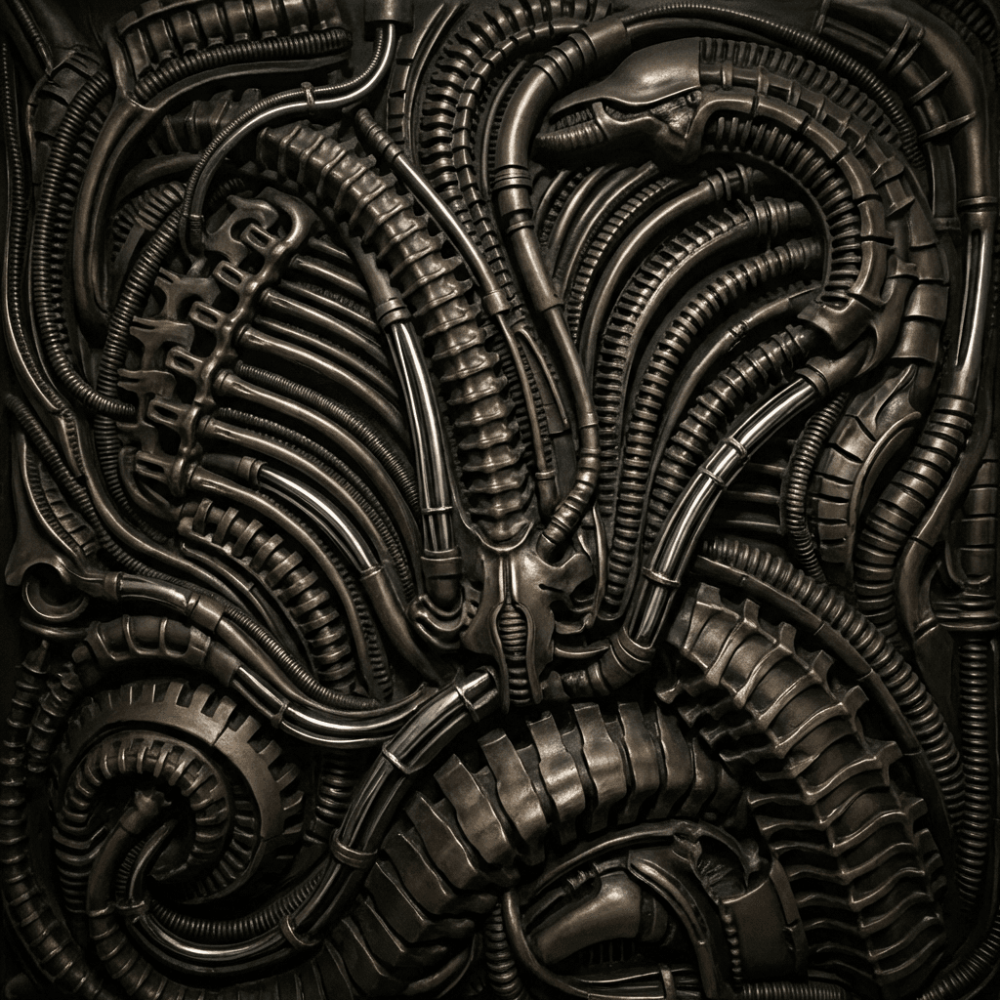<br/><sub><b>H.R. Giger</b> <code>gigr</code></sub></td>
<td align="center">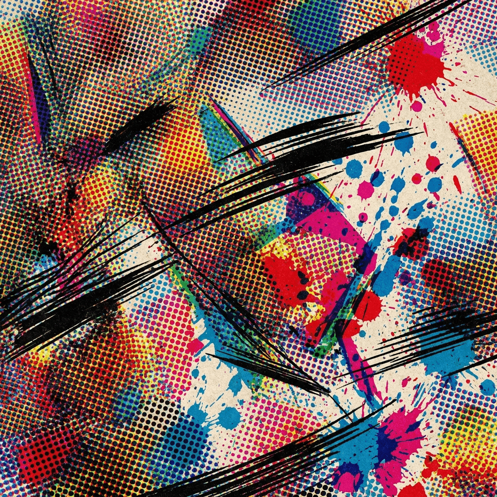<br/><sub><b>Spider-Verse</b> <code>spdr</code></sub></td>
<td align="center">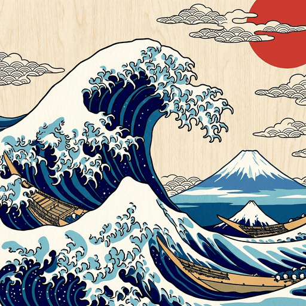<br/><sub><b>Ukiyo-e</b> <code>ukiy</code></sub></td>
<td align="center">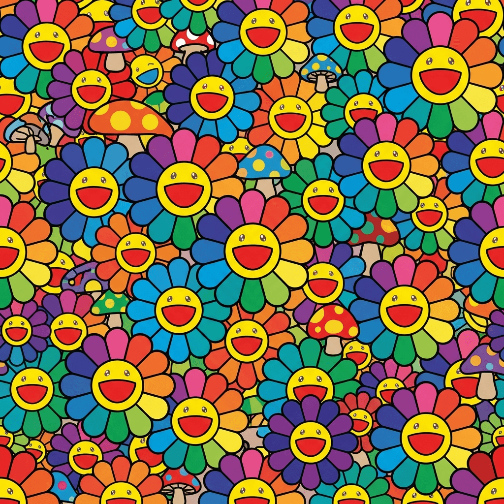<br/><sub><b>Murakami</b> <code>mrkm</code></sub></td>
<td align="center">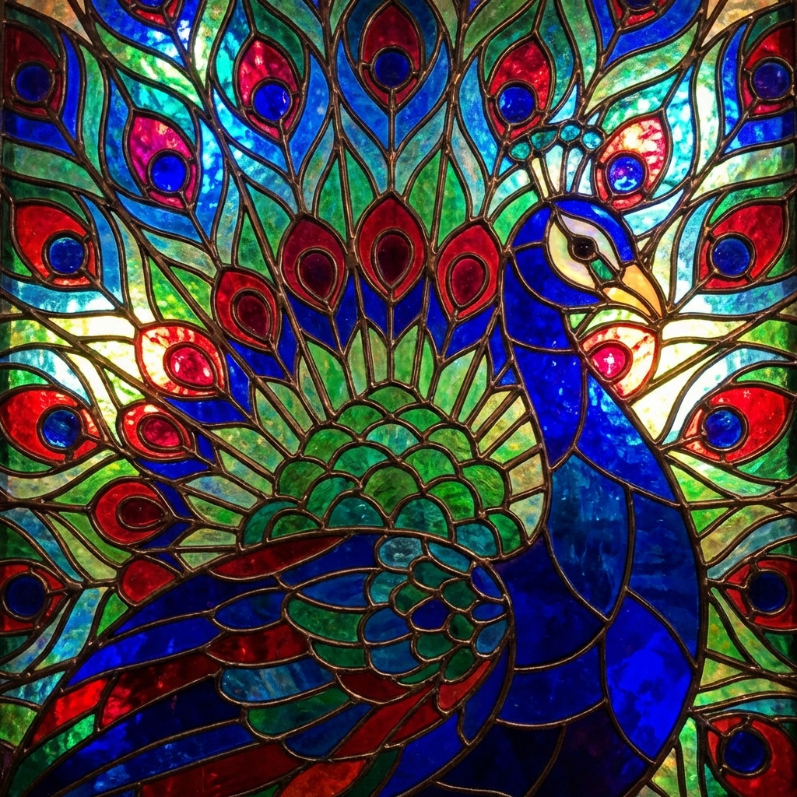<br/><sub><b>Stained Glass</b> <code>stgl</code></sub></td>
</tr>
<tr>
<td align="center">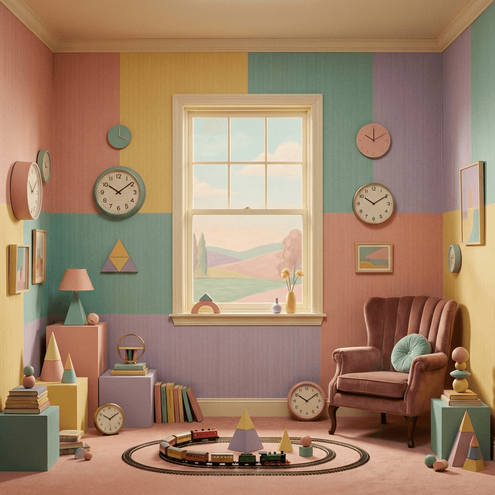<br/><sub><b>Wes Anderson</b> <code>wesa</code></sub></td>
<td align="center">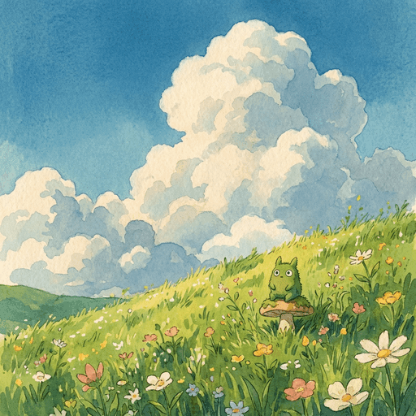<br/><sub><b>Studio Ghibli</b> <code>ghbl</code></sub></td>
<td align="center"><br/><sub><b>Impressionism</b> <code>impr</code></sub></td>
<td align="center">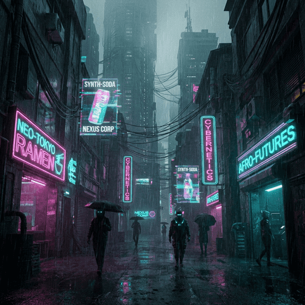<br/><sub><b>Cyberpunk</b> <code>cybr</code></sub></td>
<td align="center">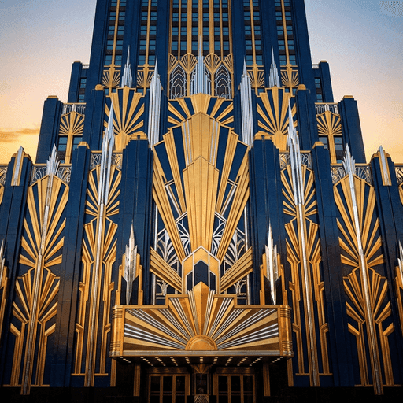<br/><sub><b>Art Deco</b> <code>deco</code></sub></td>
<td align="center">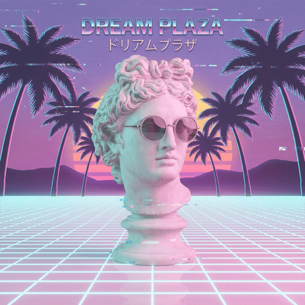<br/><sub><b>Vaporwave</b> <code>vapr</code></sub></td>
</tr>
<tr>
<td align="center">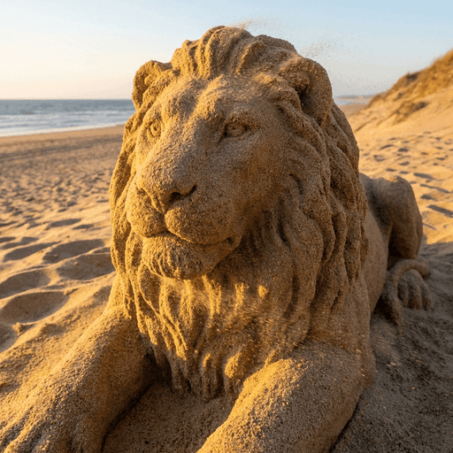<br/><sub><b>Made of Sand</b> <code>sand</code></sub></td>
<td align="center">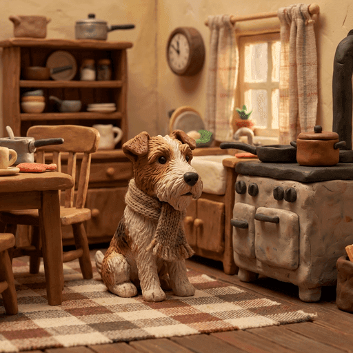<br/><sub><b>Claymation</b> <code>clay</code></sub></td>
<td align="center">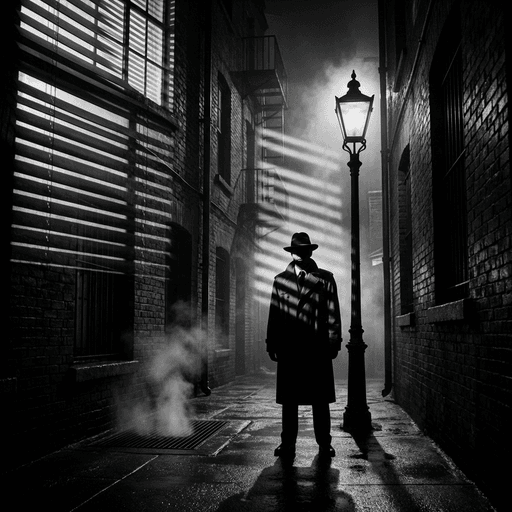<br/><sub><b>Film Noir</b> <code>fnoi</code></sub></td>
<td align="center">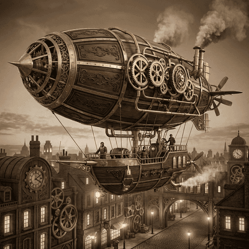<br/><sub><b>Steampunk</b> <code>stpk</code></sub></td>
<td align="center">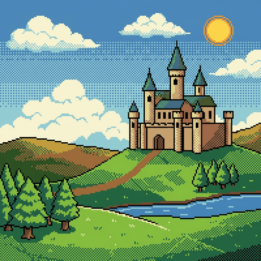<br/><sub><b>Pixel Art</b> <code>pixl</code></sub></td>
<td align="center">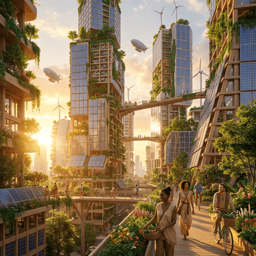<br/><sub><b>Solarpunk</b> <code>solr</code></sub></td>
</tr>
</table>

> **[View all 169 styles with categories and short codes](STYLES.md)**

### Styled Avatars & Team Photos

Transform headshots into styled portraits, then composite into group scenes.

<table>
<tr>
<td align="center"><strong>Maya</strong><br/>Creative Director</td>
<td align="center"><strong>Kai</strong><br/>Lead Engineer</td>
<td align="center"><strong>Yuki</strong><br/>Art Director</td>
<td align="center"><strong>Carlos</strong><br/>Audio Director</td>
</tr>
<tr>
<td></td>
<td></td>
<td></td>
<td></td>
</tr>
<tr>
<td></td>
<td></td>
<td></td>
<td></td>
</tr>
</table>

<p align="center">
  
</p>

> [Avatar portrait demo](skills/avatar-portrait/examples/team-portraits/prompt.md) | [Team group photo demo](skills/team-group-photo/examples/group-composite/prompt.md)

### Social Share & App Icons

Generate OG images cropped to platform specs, or production-ready icon sets for iOS, Android, web, and desktop from a single prompt.

<table>
<tr>
<td align="center"><strong>Input</strong></td>
<td align="center"><strong>OG 1200x630</strong></td>
<td align="center"><strong>Master Icon</strong></td>
<td align="center"><strong>No BG</strong></td>
<td align="center"><strong>App Store</strong></td>
</tr>
<tr>
<td></td>
<td></td>
<td></td>
<td></td>
<td></td>
</tr>
</table>

> [Social share demo](skills/generate-image/examples/social-share/prompt.md) | [App icon demo](skills/generate-icon/examples/gemskills-app-icon/prompt.md)

---

## Presentations

Generate complete pitch decks with consistent visual style, then restyle with any of the 169 art styles.

<table>
<tr>
<td align="center"><strong>01 Title</strong></td>
<td align="center"><strong>02 Problem</strong></td>
<td align="center"><strong>05 Portfolio</strong></td>
<td align="center"><strong>09 Traction</strong></td>
</tr>
<tr>
<td></td>
<td></td>
<td></td>
<td></td>
</tr>
<tr>
<td align="center" colspan="4"><em>Same deck, restyled with <code>--style pixl</code></em></td>
</tr>
<tr>
<td></td>
<td></td>
<td></td>
<td></td>
</tr>
</table>

> [Pitch deck demo](skills/deck-creator/examples/opl-pitch-deck/prompt.md) | [Pixel art variant](skills/deck-creator/examples/opl-pitch-deck-pixelart/prompt.md)

---

## Design & Prompt Refinement

Use ask-gemini for prompt refinement, design critique, and full page redesigns from HTML + inspiration screenshot.

**Rough concept** &rarr; **Gemini refinement** &rarr; **Generated image** (the hero image above was made this way)

**HTML + inspiration** &rarr; **Redesigned code** ([input](skills/ask-gemini/examples/design-feedback/inputs/current-page.html) &rarr; [output](skills/ask-gemini/examples/design-feedback/outputs/updated-page.html))

> [Prompt refinement demo](skills/ask-gemini/examples/prompt-refinement/prompt.md) | [Design redesign demo](skills/ask-gemini/examples/design-feedback/prompt.md)

---

## All Skills

| Skill | Description |
|-------|-------------|
| **generate-image** | AI image generation with [169 art styles](STYLES.md), multi-reference (up to 14 images), img2img |
| **generate-video** | Text-to-video, image-to-video with Veo 3.1, native audio, auto-image pipeline |
| **browsing-styles** | Browse, search, and preview all 169 art styles |
| **avatar-portrait** | Likeness-preserving avatar portraits in any requested style |
| **pixel-avatar** | Compatibility alias for pixel-style avatar requests |
| **team-group-photo** | Individual styled portraits composited into group scenes |
| **generate-icon** | Platform icons (favicon, iOS, Android, PWA, desktop) with auto sizing |
| **edit-image** | Inpainting and outpainting with masks |
| **upscale-image** | 2x/4x upscaling via Vertex AI |
| **segment-image** | Object identification and extraction |
| **optimize-images** | Batch compress PNGs/JPEGs for web using sharp |
| **generate-svg** | Vector graphics, logos, and icons |
| **section-dividers** | Transparent decorative dividers for web sections |
| **deck-creator** | Complete presentation decks with consistent visual style |
| **ask-gemini** | Text + image queries for design critique, prompt refinement, spatial analysis |

## Quick Examples

```bash
# Generate an image with art style
"Generate a mountain landscape in watercolor style"

# Generate a video from text
"Generate a video of ocean waves crashing on rocks"

# Animate an image into video
"Turn this image into a video with gentle motion"

# Create styled avatar from photo
"Create a stylized avatar portrait from my headshot"

# Ask Gemini to refine a prompt
"Ask Gemini to write a better prompt for: a futuristic city at sunset"

# Create presentation slides
"Create a pitch deck for my startup"

# Generate app icons for all platforms
"Generate a favicon for my website with a lightning bolt"
```

## Why Gemini

- **Nano Banana Pro**: Google's latest image generation model with thinking capabilities
- **Veo 3.1**: Text-to-video and image-to-video with native audio generation
- **[169 art styles](STYLES.md)**: Curated style library with AI-generated tile references for visual adherence
- **Multi-image input**: Up to 14 reference images for character consistency and scene composition
- **Spatial reasoning**: Superior visual understanding for design feedback
- **Dynamic docs**: Fetch latest API docs via [llms.txt](https://ai.google.dev/gemini-api/docs/llms.txt)

## License

MIT
