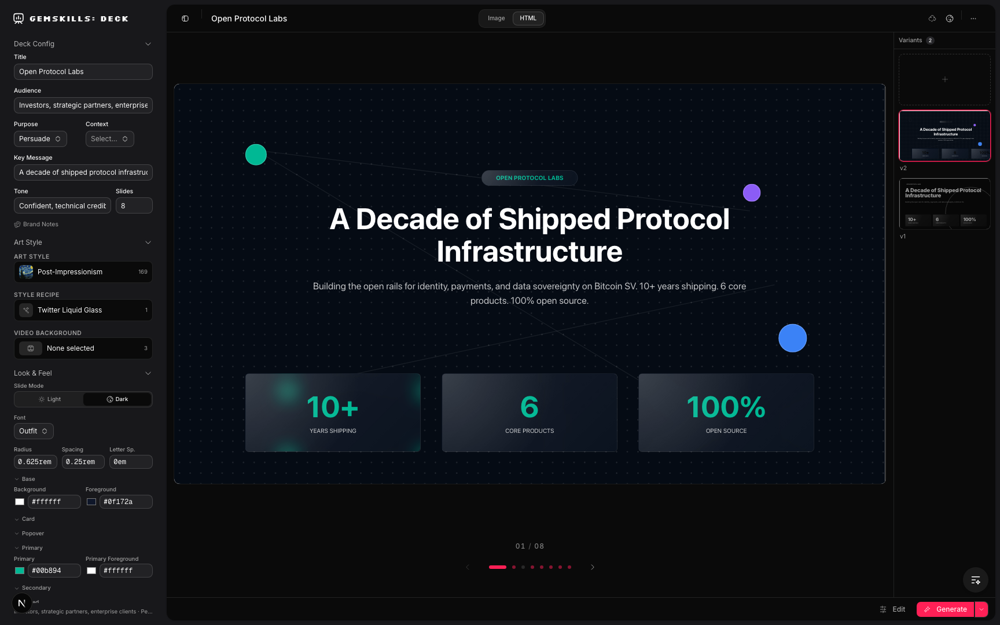

# GemSkills Deck Creator Playground

Interactive deck studio for generating and iterating slide variants in `image` and `html` modes.

## Preview



## Getting Started

Run the development server:

```bash
bun run dev
```

The app runs on [http://localhost:3457](http://localhost:3457).

## Notes

- Deck data is loaded from `DECK_DIR` when set.
- If `DECK_DIR` is not set, the server defaults to the current working directory.
- Use absolute deck paths when switching decks to avoid accidental nested directories.
- `Deck > Publish & Share...` opens method-specific share prompts (`Vercel`, `Zip`, `Cloudflare Tunnel`) based on live deck context.
- In `Vercel` mode, you can execute publish directly from the dialog with stateful job progress and logs.
